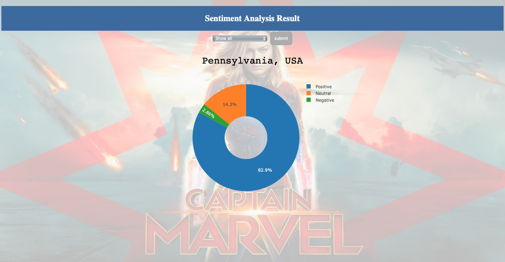

##### This project provides three different ways to get tweets
* Assuming you have docker installed, run the docker-compose.yml 
* No docker, run steaming/stream.py
* Have a premium api, use premium_search.py

##### Sentiment analysis
* Assumes that tweets are stored as newline delimited json and placed in tweet_dir
* From main.py, uncomment line under # 1. train model to train the Naive Bayes classifier.  The model is trained from 
the nltk.movie_reviews corpus
* Uncomment line under # 2. predict tweets... to use the NB model to classify the sentiment of the collected tweets.
The ouput is stored in output/nb_results.json
* To classify sentiment using vader, uncomment # 3 predict tweets using Vader... The output is stored in 
output/vader_class_results.json

##### Compare Naive Bayes to Vader classifier
* Run benchmark/benchmark_models.py. Evaluation metrics for the models are printed to the console.  4000 randomly
selected movie reviews from the IMDB dataset (https://www.kaggle.com/iarunava/imdb-movie-reviews-dataset) are used for evaluation

##### Webapp
* The webapp displays data from front_end/app_data; add your data there
* Start the web app by running front_end/app.py

##### API key update
* update api keys annotated with "update me"